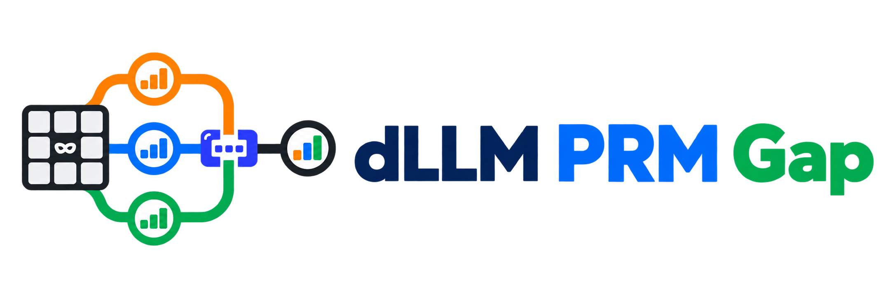
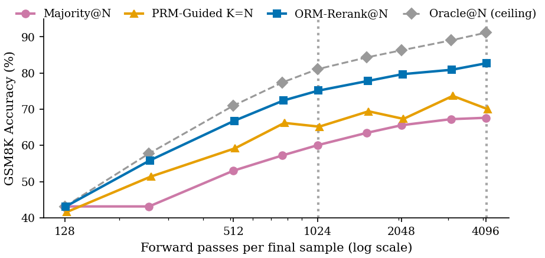
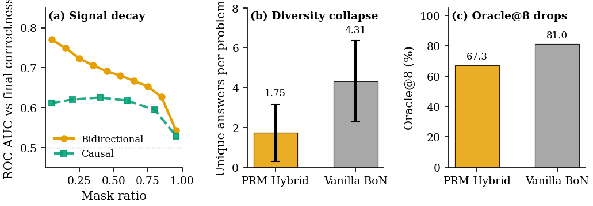
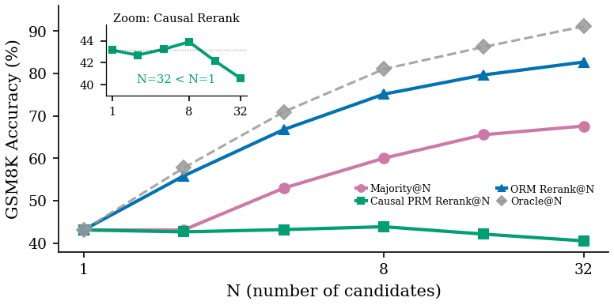
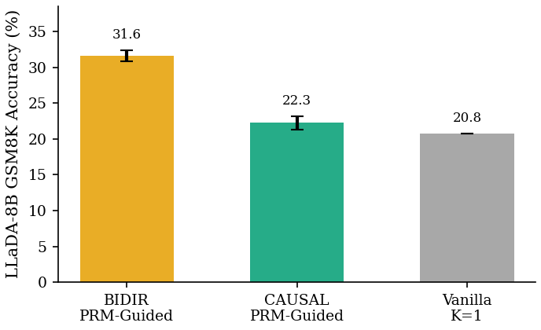

<h1 align="center">
  <br>
  Why Deterministic PRM Guidance Underperforms in Discrete Diffusion Reasoning
</h1>

<div align="center">

[](https://arxiv.org/abs/2609.35472)
[](https://github.com/dLLM-PRM-Gap/dLLM-PRM-Gap)
[](https://huggingface.co/datasets/YanZhanPKU/dLLM-PRM-Gap-Datasets)
[](LICENSE)
[](https://www.python.org/downloads/)

</div>

<h5 align="center">If this release is useful, please star the repository for future updates ⭐</h5>

<div align="center">
  
</div>

## 📣 Latest News

- **[2026-09]**: 📄 Paper accepted at NeurIPS 2026 and released on arXiv.
- **[2026-09]**: 🚀 Public code, dataset, and adapter release is available through GitHub and the Hugging Face collection.

## 💡 Overview

Discrete diffusion reasoning can use a process reward model (PRM) during denoising or an outcome reward model (ORM) after candidate generation. This release is the code and selected artifacts for a controlled diagnostic study of those choices.

The release follows the paper's experimental path: matched-compute PRM guidance and ORM reranking on Dream-v0-Instruct-7B, scorer readout and mask-ratio controls, causal readouts, candidate-retention checks, and a LLaDA cross-backbone path. The repository keeps the experiment surfaces needed to inspect and reproduce that path without publishing machine launchers, private logs, or full base-model checkpoints.

## 🔬 Diagnostic path

- **Guidance:** bidirectional and causal PRMs score intermediate denoising states.
- **Reranking:** ORM and PRM candidates are compared under matched candidate budgets.
- **Controls:** mask-ratio, suffix, two-pass, top-M, and scorer-readout checks isolate where guidance changes.
- **Backbones:** the main Dream path is paired with a compact LLaDA cross-backbone diagnostic.

<p align="center">
  
</p>

<p align="center">
  
</p>

<p align="center">
  
</p>

<p align="center">
  
</p>

## 🔧 Installation

```bash
git clone https://github.com/dLLM-PRM-Gap/dLLM-PRM-Gap.git
cd dLLM-PRM-Gap

conda create -n dllm_prm_gap python=3.10 -y
conda activate dllm_prm_gap
pip install -e .
```

The Dream and LLaDA model implementations are loaded from their upstream projects. Install the matching upstream evaluation code under `external/`, or expose it through `PYTHONPATH`. The base checkpoints are downloaded from:

- [`Dream-org/Dream-v0-Instruct-7B`](https://huggingface.co/Dream-org/Dream-v0-Instruct-7B)
- [`GSAI-ML/LLaDA-8B-Base`](https://huggingface.co/GSAI-ML/LLaDA-8B-Base)

## 📦 Models & Data

### Model adapters

The compact adapters are available in the [dLLM PRM Gap collection](https://huggingface.co/collections/YanZhanPKU/dllm-prm-gap). They contain trainable parameters only; the base language models remain upstream artifacts.

The collection contains the submitted-paper Dream PRM/ORM pair, the two causal readout controls, the two LLaDA cross-backbone controls, and the six C3 ORM-protocol controls. Their release scope and roles are summarized in [`WEIGHT_PROVENANCE.md`](WEIGHT_PROVENANCE.md).

### Dataset artifacts

The selected trajectory and diagnostic artifacts are in [dLLM-PRM-Gap-Datasets](https://huggingface.co/datasets/YanZhanPKU/dLLM-PRM-Gap-Datasets). The main trajectory is a PyTorch artifact, so it is loaded with `torch.load` rather than the Hub table viewer.

## 🚀 Quickstart

The commands below use repo-relative paths and training-time checkpoints. Set `TRAJECTORY_DIR`, `PRM_CHECKPOINT`, and `OUTPUT_DIR` to your local copies as needed.

```bash
# Train a bidirectional PRM
bash scripts/train.sh

# Inspect PRM step accuracy by mask ratio
python src/prm/eval_prm_step_accuracy.py \
  --trajectory_dir ./datasets/train_snapshots \
  --prm_checkpoint "$PRM_CHECKPOINT" \
  --output_dir ./results/step_accuracy

# Run PRM-guided decoding
python src/prm/eval_prm_guided_sharded.py \
  --task gsm8k \
  --prm_checkpoint "$PRM_CHECKPOINT" \
  --branch_factor 8 --branch_every 64 \
  --output_dir "$OUTPUT_DIR"

# Rerank pre-generated candidates with an ORM
python src/prm/eval_orm_rerank.py \
  --from_trajectories ./datasets/test_trajectories \
  --orm_checkpoint ./checkpoints/orm_gsm8k/best.pt \
  --output_dir ./results/orm_rerank
```

The top-M, suffix-control, two-pass, MATH500, SMC, and LLaDA paths are exposed as separate entry points under [`src/prm/`](src/prm/) and [`src/evaluation/`](src/evaluation/). Focused protocol tests can be run with:

```bash
PYTHONPATH=.:src pytest -q tests
```

## 🗂️ Repository layout

| Path | Role |
|---|---|
| `src/prm/` | PRM/ORM models, denoising, candidate generation, and diagnostics |
| `src/evaluation/` | evaluation and aggregation helpers |
| `datasets/` | selected trajectory and small diagnostic artifacts |
| `weights/` | compact adapter weights, metadata, and cards |
| `assets/` | project logo and paper figures |
| `tests/` | protocol, candidate-pool, checkpoint, and stable-decoding tests |

## ⚠️ Release status

This release accompanies the arXiv paper. The repository contains the focused code, adapters, trajectory corpus, figures, and diagnostic artifacts needed for reproducible matched-compute comparisons; it does not redistribute base-model checkpoints or private training logs.

## 📄 Citation

```bibtex
@misc{zhan2026deterministicprmguidanceunderperforms,
  title        = {Why Deterministic PRM Guidance Underperforms in Discrete Diffusion Reasoning},
  author       = {Yan Zhan and Shaobo Liu and Zhijun Gao},
  year         = {2026},
  eprint       = {2609.35472},
  archivePrefix = {arXiv},
  primaryClass = {cs.AI},
  url          = {https://arxiv.org/abs/2609.35472},
}
```

## 📜 License

MIT. See [`LICENSE`](LICENSE).
